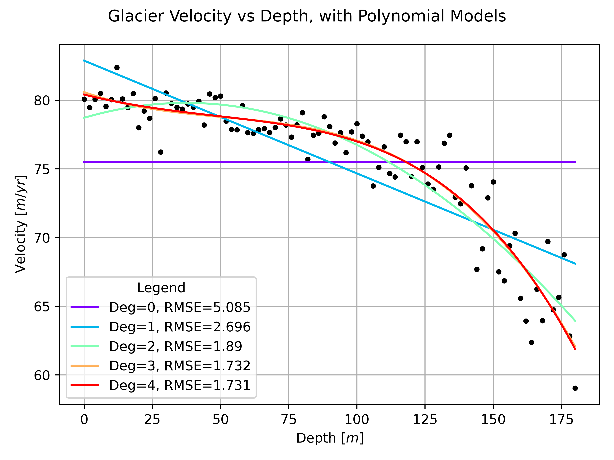
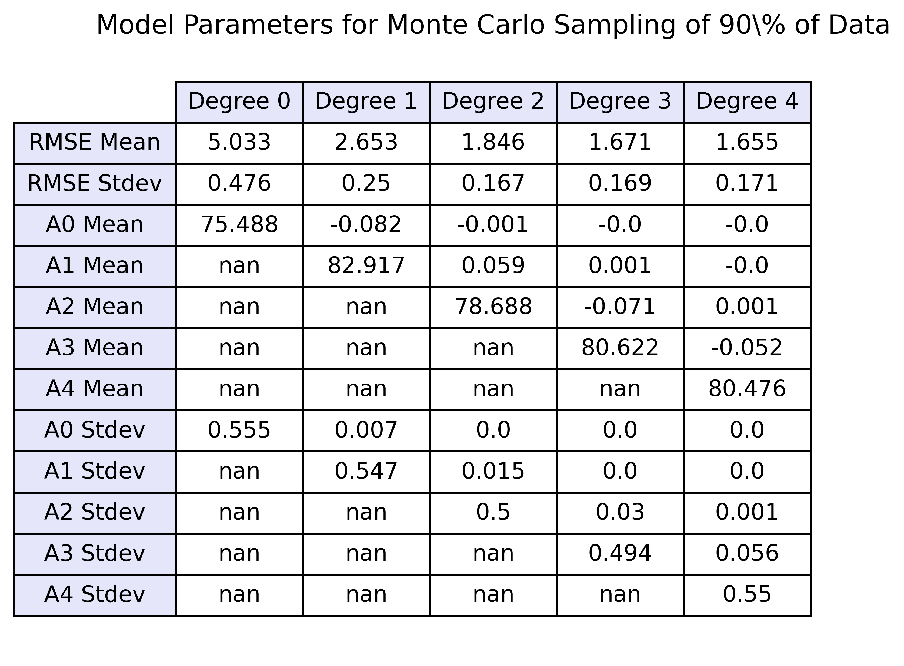
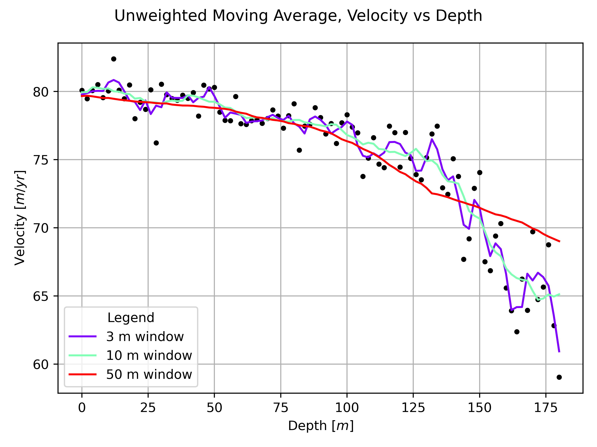
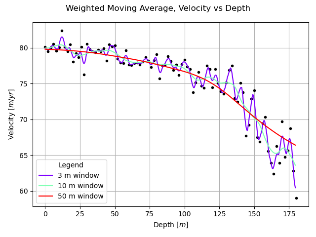

# GEOPH 522: HW 3
* Author: Madeline Hunt
* Date: 25 Oct 2024

## (A) Code Overview
Code for this homework is in `main.py`, with utility functions in `utils.py` and `utils_plot.py`. Figures are stored in the `/figures` subdirectory.

The dataset, `icevelocity.txt`, is a series of measurements of velocity (in m/yr) at varying depths (in m) in the Worthington Glacier, Alaska. 

## (B) Parametric Statistical Models

1. I fit the data using polynomial models with degrees 0-4 and plotted these overlying the data on the same figure, as seen below. Visually, the degree 3 and 4 models appear to fit the data best; these models also have the lowest RMSE. However, with increasing degree of polynomial, the model becomes at more risk of overfitting the data.

2. Next, I used Monte Carlo sampling to take samples of 90% of the total data and fit a model to that 90%. I repeated this 1000 times for each polynomial model degree. Results for the mean and standard deviation for each model parameter are reported in the table below, along with the RMSE. Nans are reported where parameters are not used for that particular model (e.g. a degree 0 model only has one parameter, A0, so the other parameters are nan).

## (C) Cross-Validation

3. I used a cross-validataion approach to more robustly estimate the error of the various degree polynomial models. Over 1000 iterations, I randomly sampled 90% of the data to fit the model, and tested this model on the remaining 10% of the data. At each iteration, I calculated and stored the RMSE. I repeated this process for each degree of polynomial from 0-4, with 1000 iterations each. The distribution of RMSE values are plotted for each degree polynomial below.

## (D) Non-Parametric Statistical Models

4. 

5. 

6. Optimum window size

## (E) Theoretical Ice Flow Model

7. 
8. 
9.
10. 
11. 
12.
13.

    # first col is depth (z), second col is velocity (v)    
    # holes drilled every 2 m, inclinometer in each hole and freeze over, 
    #   watch column/hole deform over time
    #   can tell how velocity of glacier changes with depth
    #   fastest vel at surface, decrease towards bed; slip at the bed, so x-intercept is non-zero
    #   want to fit data to predict velocity everywhere
    #   fit polynomial velocity model v_m(z) = A0 + A1z + A2z^2 + ... + Anz^n
    #       fit different polynomial degrees
