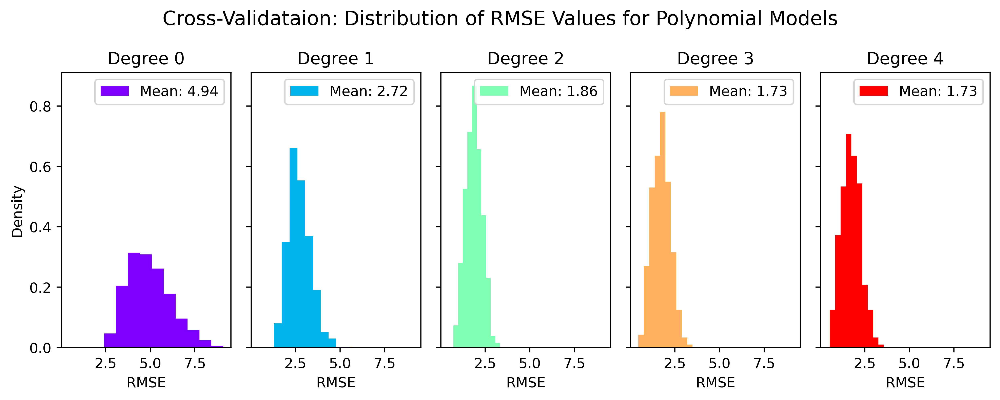
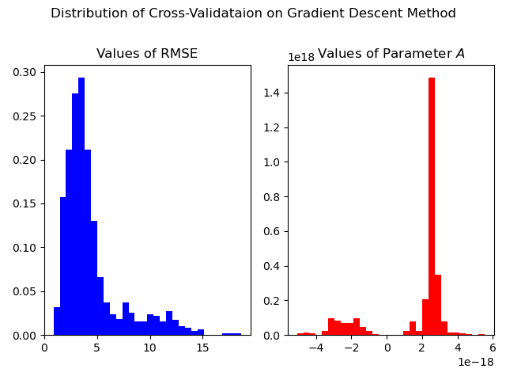

# GEOPH 522: HW 3
* Author: Madeline Hunt
* Date: 25 Oct 2024

## (A) Code Overview
Code for this homework is in `main.py`, with utility functions in `utils.py` and `utils_plot.py`. Figures are stored in the `/figures` subdirectory.

The dataset, `icevelocity.txt`, is a series of measurements of velocity (in m/yr) at varying depths (in m) in the Worthington Glacier, Alaska. 

## (B) Parametric Statistical Models

1. I fit the data using polynomial models with degrees 0-4 and plotted these overlying the data on the same figure, as seen below. Visually, the degree 3 and 4 models appear to fit the data best; these models also have the lowest RMSE. However, with increasing degree of polynomial, the model becomes at more risk of overfitting the data.

2. Next, I used Monte Carlo sampling to take samples of 90% of the total data and fit a model to that 90%. I repeated this 1000 times for each polynomial model degree. Results for the mean and standard deviation for each model parameter are reported in the table below, along with the RMSE. Nans are reported where parameters are not used for that particular model (e.g. a degree 0 model only has one parameter, A0, so the other parameters are nan).

## (C) Cross-Validation

3. I used a cross-validataion approach to more robustly estimate the error of the various degree polynomial models. Over 1000 iterations, I randomly sampled 90% of the data to fit the model, and tested this model on the remaining 10% of the data. At each iteration, I calculated and stored the RMSE. I repeated this process for each degree of polynomial from 0-4, with 1000 iterations each. The distribution of RMSE values are plotted for each degree polynomial below.

## (D) Non-Parametric Statistical Models

4. I calculated a moving average for window lenghts of 3, 10, and 50 m. These are plotted with the data in the figure below. The smallest moving window (3 m) appears to overfit the data, going through most data points, while the largest moving window (50 m) is very smooth, and captures the general trend but not much more. 

5. I then calculated a moving window average with weights from the bi-squared kernel. Once again, I used 3, 10, and 50 m window lengths. The weighted average appears to give a slightly smoother model than the unweighted average.

6. To find the optimum window size for this data, I used a cross-validation approach to calculate a weighted moving window average model from 90% of the data, and then applied the model to the remaining 10% of the data and calculated the RMSE. I tested window sizes between 3 and 50 m, and computed the RMSE for 1000 different iterations for each window size. 

    Below, I have plotted the mean RMSE for 1000 iterations of each window size. The model that minimizes the RMSE is the optimum window size. The minimum value is highlighted in red, which in this case is a window size of 24 m.

    During this process, a few figures were created, and the minimum RMSE value always corresponded with a **window length between 20-30 m**.

## (E) Theoretical Ice Flow Model

7. I used the brute force method to find optimum values for the parameters *A* and *n*. I calculated the RMSE for each model with *A* ranging from 1e-18 to 10e-18, and *n* from 2 to 4.

8. I plotted the RMSE as a colormap for each theoretical model with the parameters from question 7. The combination of *A* and *n* that minimize the RMSE are the optimal values.

In the figure below, we can see that there are a *range* of optimal values of *A* and *n*, as shown by the black band running through the center of the figure. **Optimal values are for an *A* across the entire range, with an *n* between 3-3.25.**

9. Next, I used the gradient search method to find optimal values of *A* and *n*. I chose an initial guess for each parameter from the results of the brute force method. By minimizing the cost function, which is the RMSE, I found optimal parameter values of: ***A* = 4.09e-18 and *n* = 3.01**.

10. I used a cross-validation method to randomly sample 90% of the dataset, find the optimal value of *A* with gradient descent, and calculate the RMSE with the remaining 10% of the data. I repeated this 1000 times. Additionally, I set *n=3* for this section, as instructed, and just found optimal values of *A*.

Below is a plot of the results of these 1000 iterations, showing the distribution of RMSE and optimal values for *A*.

As we can see from the plot, there is a wide range of *A* values, including some near -2e-18. These could be errors due to managing the precision of values internally within the gradient descent function. 

11. I added the mean value of *A* (as calculated in the distribution, above) to the figure from question (8), and added vertical errorbars using the standard deviation.

    As seen in the figure below, the error bars are very large, and the optimal value for *A* is not within the optimal region calcualted by the brute force method. Since there were so many outliers seen in the distribution, above, the median might be a better statistic to use than the mean here. 

    The optimal value for *A* and *n* calculated in question (9) are also marked with a blue star.

12.

13.

    Reject the null hypothesis; these values were *not* drawn from a normal distribution

    # first col is depth (z), second col is velocity (v)    
    # holes drilled every 2 m, inclinometer in each hole and freeze over, 
    #   watch column/hole deform over time
    #   can tell how velocity of glacier changes with depth
    #   fastest vel at surface, decrease towards bed; slip at the bed, so x-intercept is non-zero
    #   want to fit data to predict velocity everywhere
    #   fit polynomial velocity model v_m(z) = A0 + A1z + A2z^2 + ... + Anz^n
    #       fit different polynomial degrees
